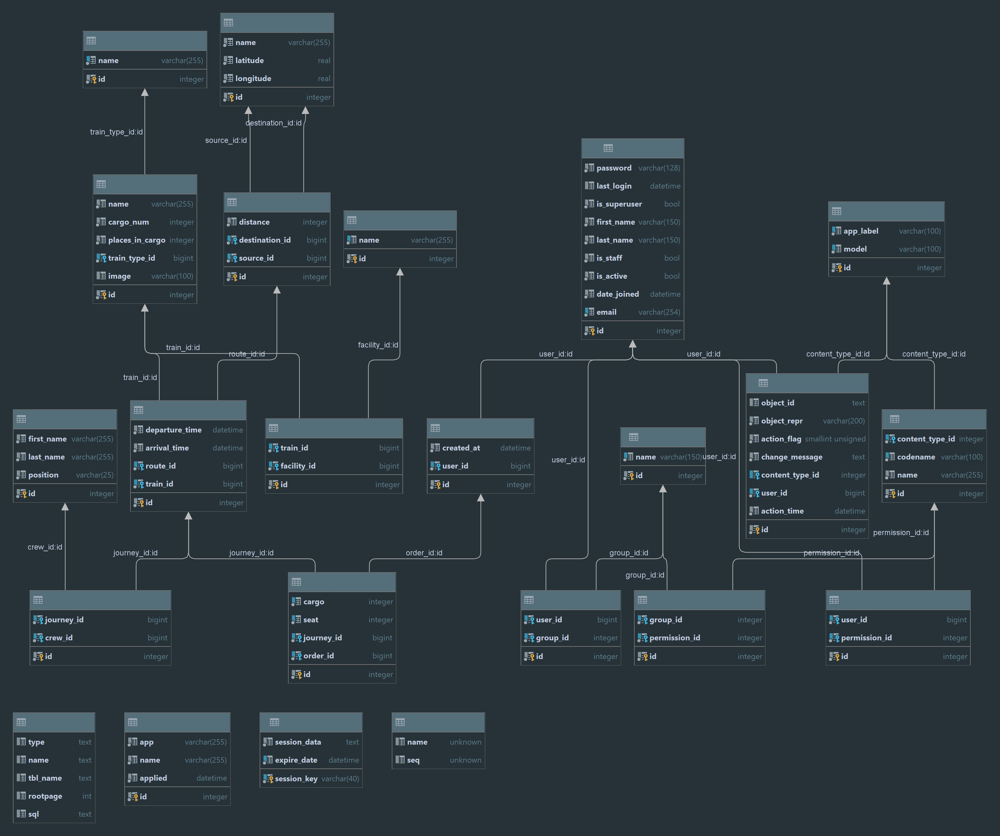

# Train Station API Service🚂🛤️

Welcome to the Train Station API Service: a comprehensive system for tracking train journeys.

The Train Station API Service is a Django-based project designed to efficiently manage and track train journeys. This system provides a platform for users to coordinate and manage various aspects of train travel. With its well-structured features, the Train Station API Service facilitates efficient information management, enabling users to handle diverse aspects of the train journey ecosystem.

## Key Features🗝️

- **Authentication:** Users are authenticated using JWTs, ensuring secure access upon successful login.
- **Admin Panel:** Admins can effortlessly add, edit, and delete data, maintaining control over the application.
- **Documentation:** Comprehensive API documentation is available through the Swagger UI.
- **Train Management:** Define and categorize different types of trains, capturing essential details such as capacity and images.
- **Station Management:** Manage stations, recording information about locations, including names and images.
- **Route Definition:** Define routes between source and destination stations, aiding in the organization of train connections.
- **Journey Tracking:** Monitor journeys with detailed information about the assigned route, train, departure, and arrival times. Additionally, manage passengers assigned to each journey.
- **Ticketing System:** Record and manage tickets for specific journeys, including details about passengers and seat assignments.

## DB Structure💻



## Installation🌟

### Using GitHub

1. Ensure you have Python 3 installed. Install PostgreSQL and create a database.

2. Clone the repository:

   ```bash
    git clone https://github.com/goldenuni/py-train-station-api-service.git
    cd py-train-station-api-service
    python -m venv venv
    venv\Scripts\activate  # On Linux\MacOS, use `source venv/Scripts/activate`
    pip install -r requirements.txt
    python manage.py migrate
    python manage.py runserver
### Run with [Docker](https://hub.docker.com/repository/docker/goldenuni/py-train-station-api-service/general)


Ensure Docker is installed.

1. Build the Docker images:

   ```bash
    docker-compose build
    docker-compose up
Access the Train Station API Service at http://localhost:8000. The development server should be up and running.
## Getting Access

1. Create a user via `/api/user/register` ✨
2. Obtain an access token via `/api/user/token` 🔐

After completing these steps, you should have access to the Train Station API Service. Enjoy exploring the features!
